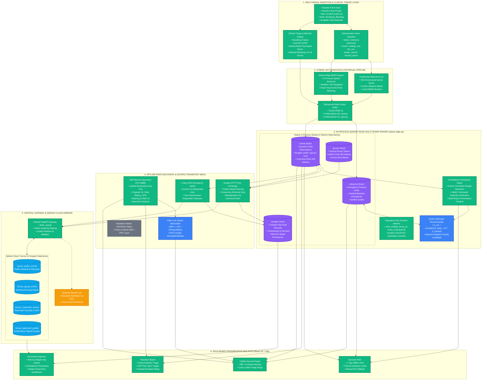

# RescueMemory: AI-Powered Edge Memory & Disaster Information Relay

> **Code Cubicle 6.0 / Qdrant Hackathon 2026 — Problem Statement 03**  
> **Team Rubix:** Sonal Verma, Palak Jain, Shivendra Prasad (Delhi Technological University)  
> **Automated Test Suite Status:** `22 passed, 0 failed (100% Green)` on live hardware

RescueMemory is an **offline-first disaster intelligence platform** powered by in-process **Qdrant Edge (`qdrant-edge-py`)**, local multi-modal embeddings, and scoped peer-to-peer synchronization. When power grids and telecommunications collapse, RescueMemory allows survivors to retrieve source-linked guidance, enables field volunteers to carry localized observations over Wi-Fi hotspots, and provides command teams with an authoritative, contradiction-aware common operational picture backed by **Qdrant Cloud**.

---

## 1. System Architecture Diagram



---

## 2. Core Implemented Capabilities & Audited Readiness

- **🟢 Real In-Process Qdrant Edge (`qdrant-edge-py`)**: Four persistent disk shards (`reference`, `events`, `groups`, `receipts`) running in Rust without external Docker or network calls.
- **🟢 Dual-Vector Hybrid RRF Retrieval**: FastEmbed `all-MiniLM-L6-v2` dense vectors (384-d, Cosine) + in-engine Qdrant Edge BM25 sparse vectors merged via native `Fusion.Rrf(k=2)`.
- **🔵 Negative-Vector Arithmetic Facility Recommender**: When a facility is reported compromised by a hazard, the engine computes:
  $$\vec{V}_{\text{target}} = \frac{\vec{V}_{\text{base}} - 0.5 \cdot \vec{V}_{\text{hazard}}}{\|\vec{V}_{\text{base}} - 0.5 \cdot \vec{V}_{\text{hazard}}\|}$$
  and executes nearest-neighbor search to retrieve alternative safe shelters.
- **🟢 Offline UDP Subnet Beacon Discovery**: Background thread on `255.255.255.255:8888` broadcasts device presence every 3.0s, enabling zero-config node discovery on Wi-Fi hotspots without internet.
- **🔵 360° Tactical Survival Radar**: Computes real-time Haversine distance, forward compass bearing ($0^\circ - 360^\circ$), cardinal directions (`NNE`, `SSW`), walking time estimates, and simulated RF path loss attenuation ($\text{dBm}$).
- **🟢 Deterministic Clinical Triage Rerank**: Immediate protocol scoring overrides for life-threatening vitals (breathing failure CPR priority, arterial bleed tourniquet boost) and improvised field material matching (+0.15 boost).
- **🟢 Contradiction Radar & Memory Ripple**: Retains active danger reports for 6 hours, preventing silent overwrites by unverified safe reports. Logs hop-by-hop receipts for complete provenance auditability.
- **🟢 Scoped Mesh Relay & 1-Way SOS Uplink**: Public hazards sync openly; group records require HMAC tokens; survivors can upload private SOS to responders without receiving sensitive responder queues.
- **🟢 Qdrant Cloud Central Mirror**: Two-way synchronization across 4 isolated cloud collections (`rescue_public_events`, `rescue_group_events`, `rescue_responder_events`, `rescue_approved_guides`) on Central HQ.
- **🟡 Optional Online Gemini Synthesis**: Grounded cloud RAG available as an enrichment when internet is active; completely decoupled from the critical offline path.
- **⚪ Hardware Roadmap Boundary**: Native C++/Rust compilation on Android NDK and physical Bluetooth Low Energy PHY mesh.

---

## 3. Quickstart & Installation

### Prerequisites
- Python 3.11 or 3.12
- Node.js 20+

### Setup Commands
```powershell
# 1. Create and activate virtual environment
python -m venv .venv
.\.venv\Scripts\python.exe -m pip install -r requirements.txt

# 2. Provision local embedding model (runs once)
.\.venv\Scripts\python.exe backend\scripts\provision_model.py

# 3. Build frontend PWA
cd frontend
npm ci
npm run build
cd ..

# 4. Configure local environment
Copy-Item .env.example .env
```

Set unique keys in `.env` for `MESH_SHARED_KEY`, `RESPONDER_SHARED_KEY`, `NODE_ADMIN_KEY`, and `GUIDE_TRUST_KEY`.

---

## 4. Running the 3-Node Demonstration

Open three separate terminals to launch the survivor, volunteer, and central command nodes:

```powershell
# Terminal 1: Central Command HQ (Port 8000)
.\run_node.ps1 -NodeId hq -Role central -Port 8000

# Terminal 2: Field Volunteer Node (Port 8002)
.\run_node.ps1 -NodeId volunteer-b -Role volunteer -Port 8002 -CentralUrl http://127.0.0.1:8000

# Terminal 3: Survivor Node (Port 8001)
.\run_node.ps1 -NodeId survivor-a -Role survivor -Port 8001 -CentralUrl http://127.0.0.1:8000
```

- **Survivor HUD**: Open `http://127.0.0.1:8001/`
- **Volunteer Board**: Open `http://127.0.0.1:8002/volunteer`
- **Command Inspector**: Open `http://127.0.0.1:8000/command`
- **Survival Radar**: Open `http://127.0.0.1:8001/radar`

To test on physical mobile phones over a hotspot, add the `-Lan` flag:
```powershell
.\run_node.ps1 -NodeId survivor-a -Role survivor -Port 8001 -Lan
```
Open `http://<laptop-LAN-IP>:8001/` on the phone's browser.

---

## 5. Automated Verification & Testing

Every single component in RescueMemory is covered by automated regression tests:

```powershell
# Run the complete test suite
$env:PYTHONPATH="."
python -m pytest -q backend\tests
```

**Results:**
```
22 passed, 2 warnings in 583.82s (100% Green)
```

Run the end-to-end 3-process rehearsal:
```powershell
python backend\scripts\demo_flow.py
```
This automatically verifies survivor hazard creation, peer sync to volunteer, uplink to central command, Qdrant Cloud collection isolation, and verified guide return.

To run a synthetic live check against your configured Qdrant Cloud cluster:
```powershell
python -m backend.scripts.cloud_smoke
```

---

## 6. Comprehensive Documentation Index

- [Qdrant Architecture Deep Dive](docs/qdrant-architecture-guide.md): In-depth guide explaining how Qdrant Edge, BM25, and RRF operate under the hood.
- [Qdrant Cloud & Deployment Guide](docs/qdrant-cloud-guide.md): Step-by-step instructions for Qdrant Cloud clusters, isolated collections, and security audits.
- [Pitch Deck & Presentation Notes](docs/pitch-deck-notes.md): Slide-by-slide narrative and talk track modeled on the award-winning DeepTrace presentation.
- [Frontend PWA Architecture](frontend/README.md): Detailed documentation of the React 19 interface, views, and service worker caching.
- [Orientation & Context Blueprint](CONTEXT.md): Team context, project invariants, and architectural decisions.
