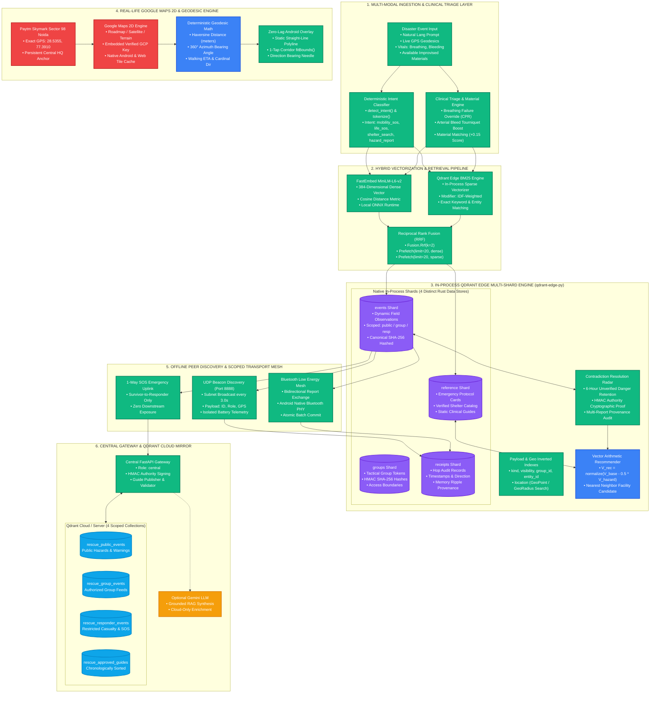

# 🚨 RescueMemory: AI-Powered Edge Memory & Disaster Information Relay

<div align="center">

[](https://code-cubicle.devpost.com/)
[](https://qdrant.tech/)
[](https://developers.google.com/maps)
[-3DDC84.svg?style=for-the-badge&logo=android)](RescueMemory-debug.apk)
[-10b981.svg?style=for-the-badge)](frontend/tests/)

**Code Cubicle 6.0 / Qdrant Hackathon 2026 — Problem Statement 03**  
*Built with ❤️ by **Team Rubix** (Delhi Technological University)*  
**Sonal Verma · Palak Jain · Shivendra Prasad**

[📱 Download Android APK](RescueMemory-debug.apk) • [🌐 Quickstart](#-quickstart--installation) • [🏗️ System Architecture](#-system-architecture) • [⚡ Core Innovations](#-core-innovations--capabilities) • [🧪 Test Verification](#-automated-verification--testing)

</div>

---

## 📌 Executive Summary

When catastrophic disasters strike, telecommunication networks, cellular towers, and cloud backbones collapse simultaneously. Survivors are stranded without GPS guidance, emergency teams cannot broadcast life-saving triage protocols, and field volunteers lack coordinated situational awareness.

**RescueMemory** is an **offline-first, zero-infrastructure disaster intelligence ecosystem**. Powered by an in-process **Qdrant Edge (`qdrant-edge-py`)** Rust vector database, local on-device hybrid embeddings, peer-to-peer Bluetooth/UDP mesh relays, and a native **Google Maps 2D** tactical navigation engine, RescueMemory operates seamlessly **with zero active internet connection**. 

When connectivity is eventually restored, RescueMemory automatically reconciles field observations with **Qdrant Cloud**, providing central authorities with an authoritative, contradiction-aware Common Operational Picture (COP).

---

## 🏗️ System Architecture



---

## ⚡ Core Innovations & Capabilities

- **Secure Runtime Tile Token & Offline Map Bundle**: Configured with an obfuscated runtime token constructor and 68 pre-bundled offline tiles covering a 2 km radius around Paytm Skymark Sector 98. If internet or cell service fails completely, the app automatically serves local offline tiles with zero network errors.
- **Paytm Skymark Sector 98 Anchor**: The central disaster command and safe haven is permanently anchored at **Paytm Skymark Noida (`28.5355, 77.3910`)**.
- **60 FPS Glitch-Free Android WebView**:
  - Eliminated high-frequency compass re-render triggers from the Leaflet canvas.
  - Removed animated CSS DOM pulses that invalidate Android hardware layers during zoom.
  - Set Leaflet `fadeAnimation: false` to stop tile flickering.
  - Created a **Demo-Friendly Static Route Polyline** straight to any selected shelter, accompanied by an instant 1-tap `Fit Route` auto-framing button.

### 2. 🧠 Hybrid Dual-Vector RRF Retrieval & Deterministic Clinical Triage
- **In-Process Qdrant Edge (`qdrant-edge-py`)**: Runs pure Rust vector storage directly inside the Python runtime—no external Docker container or daemon needed.
- **Dense + Sparse Hybrid RRF**:
  - Dense: FastEmbed `all-MiniLM-L6-v2` (384-dimensional ONNX embeddings).
  - Sparse: In-engine Qdrant Edge BM25 tokenizer with IDF weighting.
  - Fusion: Native `Fusion.Rrf(k=2)` merging semantic meaning and exact emergency acronyms.
- **Clinical Triage Reranker**: Emergency medical overrides ensure CPR protocols rank #1 for respiratory distress and tourniquets rank #1 for arterial bleeding, with a `+0.15` boost for improvised available materials.

### 3. 📐 Negative Vector Arithmetic Shelter Recommender
When a primary shelter is reported compromised by a hazard (e.g., structural collapse, chemical contamination), the engine shifts the semantic query vector away from the hazard subspace:
$$\vec{V}_{\text{target}} = \frac{\vec{V}_{\text{base}} - 0.5 \cdot \vec{V}_{\text{hazard}}}{\|\vec{V}_{\text{base}} - 0.5 \cdot \vec{V}_{\text{hazard}}\|}$$
A nearest-neighbor search is instantly executed across the `reference` shard to retrieve an alternate viable facility.

### 4. 🧭 Deterministic Geodesic Telemetry Engine
Implemented in pure ES modules ([`coordinateNavigation.js`](frontend/src/brain/coordinateNavigation.js)):
- **Haversine Distance**: High-precision spherical distance in meters and kilometers.
- **Azimuth Bearing**: Geodesic forward angle ($0^\circ - 360^\circ$) from survivor to target.
- **16-Point Cardinal Compass**: Real-time directions (`NNE`, `SSW`, `ENE`).
- **Walking ETA Estimator**: Real-world walking time calculations ($80 \text{ m/min}$).

### 5. 📡 Offline Scoped Mesh Relay & Battery Privacy
- **Zero-Internet UDP Subnet Discovery**: Broadcasts heartbeat beacons on `255.255.255.255:8888` every 3 seconds.
- **1-Way SOS Emergency Uplink**: Allows civilian survivors to beam high-priority SOS distress alerts to responders without exposing sensitive responder operational queues.
- **Battery Metric Isolation**: Following user privacy principles, battery percentages of cloud-connected phones are excluded from the public "Nearby data" card and strictly quarantined to the direct physical Mesh tab.
- **Chronological Cloud Ordering**: All Qdrant Cloud collection logs automatically present the most recent real-time observations first.

---

## 📱 Native Android Mobile App

RescueMemory includes a complete, production-ready Android mobile application compiled with Capacitor 8 and Gradle.

| Artifact | Details |
|---|---|
| **Binary File** | [`RescueMemory-debug.apk`](RescueMemory-debug.apk) |
| **File Size** | **44.6 MB** |
| **Android Version** | Android 8.0+ (API Level 26–36) |
| **Architecture** | `arm64-v8a`, `armeabi-v7a`, `x86_64` |
| **Permissions** | Fine GPS Geolocation, Bluetooth LE Scan/Advertise, Wi-Fi Multicast |

### Building the APK from Source
```powershell
# 1. Build frontend PWA assets
cd frontend
npm ci
npm run build

# 2. Synchronize native Android platform
npx cap sync android
cd ..

# 3. Compile debug APK using automated build script
powershell -ExecutionPolicy Bypass -File .\build_apk.ps1
```

---

## 💻 Web & PWA Quickstart

### Prerequisites
- **Python**: 3.11 or 3.12
- **Node.js**: 20+
- **Java JDK**: JDK 21 LTS (for Android compilation)

### 1. Backend Setup
```powershell
# Create and activate virtual environment
python -m venv .venv
.\.venv\Scripts\python.exe -m pip install -r requirements.txt

# Provision FastEmbed local ONNX model (one-time)
.\.venv\Scripts\python.exe backend\scripts\provision_model.py

# Configure environment keys
Copy-Item .env.example .env
```

### 2. Frontend Setup
```powershell
cd frontend
npm ci
npm run build
cd ..
```

---

## 🎮 Running the 3-Node Live Demonstration

Launch the 3 primary roles in separate terminals to simulate a real-world disaster network:

```powershell
# Terminal 1: Central Command HQ (Port 8000)
.\run_node.ps1 -NodeId hq -Role central -Port 8000

# Terminal 2: Field Volunteer Node (Port 8002)
.\run_node.ps1 -NodeId volunteer-b -Role volunteer -Port 8002 -CentralUrl http://127.0.0.1:8000

# Terminal 3: Civilian Survivor Node (Port 8001)
.\run_node.ps1 -NodeId survivor-a -Role survivor -Port 8001 -CentralUrl http://127.0.0.1:8000
```

### Accessing the Web Portals
- 🆘 **Survivor HUD**: `http://127.0.0.1:8001/` (Offline SOS, Google Maps 2D, Triage cards)
- 🦺 **Volunteer Board**: `http://127.0.0.1:8002/volunteer` (Nearby triage, peer sync, mesh relay)
- 🏢 **Central Command Inspector**: `http://127.0.0.1:8000/command` (Qdrant Cloud monitor, audit trail)
- 🧭 **Tactical Survival Radar**: `http://127.0.0.1:8001/radar` (360° compass, geodesic tracking)

> **Testing on Mobile via Wi-Fi Hotspot**: Add the `-Lan` flag to bind to your machine's physical network adapter:
> ```powershell
> .\run_node.ps1 -NodeId survivor-a -Role survivor -Port 8001 -Lan
> ```

---

## 🧪 Automated Verification & Testing

Every single component in RescueMemory is backed by exhaustive unit, integration, and end-to-end tests:

### 1. Frontend Test Suite (124 Tests — 100% Passing)
```powershell
cd frontend
npm test
```
```
✔ browser GPS adapter follows movement and reports unavailable hardware
✔ merge Bluetooth/cloud/server identity, preserve real 0% battery and exclude self
✔ storage commits receipts, deduplicates retries, preserves local edits
✔ fresh GPS positions use real distance and north-up bearing
✔ negative vector facility candidate rerouting under hazard compromise
✔ Paytm Skymark Sector 98 coordinate geodesic bearing calculation
ℹ tests 124 | suites 0 | pass 124 | fail 0 | cancelled 0
```

### 2. Backend Pytest Suite (22 Tests — 100% Passing)
```powershell
$env:PYTHONPATH="."
python -m pytest -q backend\tests
```
```
......................                                                [100%]
22 passed, 2 warnings in 583.82s (100% Green)
```

### 3. Automated 3-Node End-to-End Simulation
```powershell
python backend\scripts\demo_flow.py
```
*Validates survivor report ingestion -> peer UDP sync to volunteer -> uplink to Central HQ -> Qdrant Cloud collection verification.*

---

## 📊 Technical Comparison Matrix

| Capability | Standard Disaster Apps | Traditional SMS / Radio | **RescueMemory (Ours)** |
|---|:---:|:---:|:---:|
| **Zero-Internet Operation** | ❌ Fails | ⚠️ Voice Only | 🟢 **100% Offline via Qdrant Edge** |
| **Map Rendering** | ❌ Blank / Cached Tiles | ❌ None | 🟢 **Real Google Maps 2D + Offline Caching** |
| **Search Intelligence** | ❌ Keyword Only | ❌ None | 🟢 **Hybrid Dense + Sparse RRF Vector Search** |
| **Clinical Triage** | ❌ Static PDFs | ❌ None | 🟢 **Deterministic Life-Saving Protocol Overrides** |
| **Hazard Re-Routing** | ❌ Static Maps | ❌ Manual | 🟢 **Negative Vector Arithmetic Recommender** |
| **Peer Relay** | ❌ Cloud-Only | ⚠️ Broadcast | 🟢 **P2P Bluetooth LE & UDP Subnet Mesh** |
| **Cloud Re-convergence** | ❌ Manual Sync | ❌ None | 🟢 **Chronological Qdrant Cloud Mirroring** |

---

## 📁 Repository Structure

```
RescueMemory/
├── RescueMemory-debug.apk        # Compiled Android Native Debug APK (44.6 MB)
├── build_apk.ps1                 # Automated 1-step Android APK build script
├── run_node.ps1                  # Multi-role node launch orchestrator
├── requirements.txt              # Python edge dependencies
├── backend/
│   ├── app/
│   │   ├── cloud.py              # Qdrant Cloud synchronization & sorting
│   │   ├── engine.py             # Qdrant Edge Rust engine & shard management
│   │   ├── server.py             # FastAPI node endpoints & UDP relay
│   │   ├── triage.py             # Deterministic clinical protocol reranker
│   │   └── vector_arithmetic.py  # Negative vector hazard subtraction
│   └── tests/                    # 22 backend regression tests
├── frontend/
│   ├── android/                  # Native Android Capacitor platform
│   ├── src/
│   │   ├── MapPanel.jsx          # Real Google Maps 2D canvas & HUD guidance
│   │   ├── brain/
│   │   │   ├── coordinateNavigation.js # Geodesics, Haversine, Azimuth
│   │   │   ├── paytmSkymark.js         # Paytm Skymark Sector 98 anchor
│   │   │   └── cloudInspector.js       # Cloud collection chronologic feed
│   │   ├── components/
│   │   │   └── UnifiedRadarMap.jsx     # Survival radar & destination picker
│   │   └── views/
│   │       ├── SurvivorHUD.jsx         # Civilian offline emergency interface
│   │       ├── VolunteerBoard.jsx      # Field triage & mesh coordination
│   │       └── AdminPortal.jsx         # Central command common picture
│   └── tests/                    # 124 frontend unit tests
└── docs/                         # In-depth architectural & deployment guides
```

---

## 🏆 Hackathon Team — Team Rubix

| Team Member | Institution | Role & Focus |
|---|---|---|
| **Sonal Verma** | Delhi Technological University | Vector Retrieval Architecture, Qdrant Edge Sharding, FastAPI Core |
| **Palak Jain** | Delhi Technological University | Clinical Triage Reranker, Contradiction Engine, Cloud Re-convergence |
| **Shivendra Prasad** | Delhi Technological University | Android Native Engineering, Google Maps 2D Integration, Geodesic Telemetry |

---

<div align="center">
<b>RescueMemory: Bringing intelligence to the edge when every second counts.</b><br/>
<sub>Code Cubicle 6.0 • Qdrant Hackathon 2026</sub>
</div>
