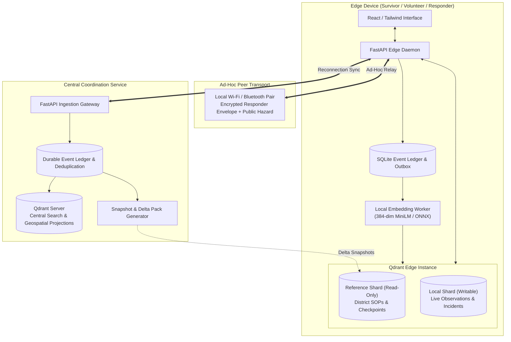

# RescueMemory 🛟⚡
### AI-Powered Offline Edge Memory & Incident Intelligence Mesh
*Built for **Code Cubicle 6.0 — Problem Statement 03 (Qdrant: AI-Powered Edge Memory & Intelligence Platform)***

---

> **"RescueMemory makes disconnected disaster reports searchable and useful on edge devices, then carries them into a shared rescue picture when connectivity becomes available."**

---

## 📌 Executive Summary & Problem Statement

### The Critical Challenge
During natural disasters (cyclones, floods, earthquakes) and major infrastructure collapses, communications infrastructure fails first:
- **Cellular towers go dark**, power grids collapse, and backhaul fiber lines are severed.
- **Survivors and volunteers are trapped in communication blackouts**, unable to reach cloud services or emergency dispatch centers.
- **Pre-disaster data becomes obsolete within minutes**: A checkpoint marked *operational* at 08:50 may be flooded with exposed high-voltage wires by 09:25.
- **Traditional AI and search architectures break down**: Cloud-dependent vector databases, remote LLM APIs, and centralized search engines cannot function with zero connectivity.

### The Solution: RescueMemory
**RescueMemory** is an offline-first, edge-native intelligence platform powered by **Qdrant Edge**. It provides continuous semantic retrieval, local conflict resolution, ad-hoc peer-to-peer relay, and cloud-edge synchronization across disconnected nodes.

```
       [Central Qdrant Server & Dispatch]
                       ▲
                       │ Intermittent / Delayed Reconnection (10:05)
                       │
       ┌───────────────┴───────────────┐
       │                               │
[Survivor Device A] ──── Peer Relay ───► [Volunteer Device B] ───► [Responder Device C]
 (Offline Qdrant Edge)  (Local Wi-Fi)     (Data Mule / Edge)      (Field Search & Action)
```

---

## 🌟 Key Innovations & Technical Features

### 1. 🔋 True Offline-First Hybrid Retrieval (Qdrant Edge)
- **Local Dense & Sparse Indexing**: Edge devices run **Qdrant Edge** directly on-device. Dense semantic vectors (384-dim) capture intent (e.g., *"drinking water"* matches *"potable water"* or *"cannot walk"* matches guidance on bone fractures), while on-device BM25 preserves critical exact tokens (checkpoint IDs like `CP-17`, medical terms, names).
- **Reciprocal Rank Fusion (RRF)**: Native edge prefetching and fusion combine dense and sparse candidate sets without external network round-trips.
- **Fast Local Execution**: Queries execute entirely in-process under strict resource boundaries (<50ms warm query target).

### 2. 🛡️ Dual-Shard Memory Architecture & Non-Destructive Conflict Resolution
- **Reference Shard (Read-Only)**: Holds the authorized regional district pack downloaded before or between outages (reviewed safety SOPs, base shelters, initial operational checkpoints).
- **Local Shard (Writable)**: Stores live on-the-ground observations, emerging hazards, and survivor emergency requests.
- **Contradiction Management**: Rather than overwriting central truth, local observations contradict stale records transparently. For example, `CP-17` displays both:
  - *Server baseline:* Verified operational at 08:50.
  - *Local observation:* Flooded entrance & exposed live wires reported at 09:25.
  Both records are searchable; vector similarity alone never silently erases safety warnings.

### 3. 🤝 Privacy-Preserving Peer Relay ("Data Mule" Protocol)
- Information leaves stranded zones **before** cellular connectivity returns.
- When Survivor A and Volunteer B come into local Wi-Fi / ad-hoc range:
  - **Public Hazards** (e.g., road blockages, live wires) are synchronized and indexed into Volunteer B's local Qdrant Edge shard for immediate offline searching.
  - **Restricted Survivor Reports** (e.g., medical state, identity, mobility limitation) are sealed in an **encrypted envelope**, carried as a payload that only authorized responder keys can unlock.

### 4. ⏱️ Timeline Reconstruction & Provenance Engine
- Reconstructs chronological truth upon cloud reconnection by strictly separating:
  - `observed_at`: Exact timestamp when the survivor witnessed the hazard or injury.
  - `received_at`: Timestamp when the central server or responder ingested the report.
- **Zero Confusion**: An hour-old report relayed over mesh never masquerades as a fresh event.
- **Idempotent Deduplication**: Multiple relays carrying identical reports are merged cleanly by UUID; similar reports are flagged for human responder triage rather than blindly merged.

### 5. 🔍 Multi-Modal Responder Search & Actionable Checklists
- First responders can execute rich composite queries across central Qdrant Server:
  > *"Find unresolved cases near CP-17 where someone cannot move without assistance."*
- Combines semantic matching on natural language statements + exact match on checkpoint ID + geographic bounding radius + structured status filters (`unresolved`, `authorized`).
- Automatically correlates mobility constraints with reviewed field equipment checklists (e.g., stretcher, splints, pediatric supplies).

---

## 🎬 The 8-Scene Demonstration Scenario

RescueMemory is validated against an end-to-end multi-device disaster scenario:

| Scene | Time | State | Operational Event & System Action |
| :--- | :---: | :---: | :--- |
| **1. Baseline Download** | `09:00` | 🟢 Online | Survivor A downloads District Knowledge Pack (CP-17 operational, shelter facilities, SOPs) into Qdrant Edge reference shard. |
| **2. Total Outage Search** | `09:15` | 🔴 Offline | Cellular grid collapses. Survivor queries: *"Where can I find shelter with drinking water?"* Edge hybrid search locates CP-17 offline. |
| **3. Ground Contradiction** | `09:25` | 🔴 Offline | Survivor reaches CP-17: finds flooded gate and exposed live wires. Saves local hazard. Dual-shard engine displays hazard warning alongside stale server status. |
| **4. Injury & Guidance** | `09:30` | 🔴 Offline | Survivor falls near gate: *"I fell near the gate. My leg hurts and I cannot walk."* App creates confirmed rescue report; Qdrant retrieves first-aid guidance. State: `Saved on device`. |
| **5. Ad-Hoc Peer Relay** | `09:45` | 🟡 Peer Mesh | Volunteer B comes within local Wi-Fi range. Survivor A pairs with B. Encrypted rescue report + public hazard transfer to B. State: `Copied to volunteer device`. |
| **6. Central Reconnection** | `10:05` | 🟢 Reconnected | Volunteer B enters connected zone and uploads outbox. Central ledger reconstructs timeline: separates `observed_at` (09:25) from `received_at` (10:05). |
| **7. Responder Query** | `10:10` | 🟢 Responders | Responder C queries: *"Unresolved cases near CP-17 where someone cannot move without assistance."* Surfaces survivor record with distance and equipment checklist. |
| **8. Updated Knowledge Loop** | `10:15` | 🔄 Dynamic Loop | Central server publishes delta snapshot. Other offline devices downloading the pack now see CP-17 electrical hazard; resolved cases disappear from active queues. |

---

## 🏗️ System Architecture



---

## 📊 4-Stage Delivery State Machine

Every emergency report tracks transparent delivery progress:

```
┌──────────────┐       Local Wi-Fi       ┌──────────────┐      Backhaul Uplink    ┌──────────────────┐      Field Action     ┌────────────────────────┐
│ Saved on     │ ──────────────────────► │ Copied to    │ ──────────────────────► │ Received         │ ────────────────────► │ Responder              │
│ this Device  │                         │ Volunteer    │                         │ Centrally        │                       │ Acknowledged           │
└──────────────┘                         └──────────────┘                         └──────────────────┘                       └────────────────────────┘
```

---

## ⚡ Performance & Engineering Targets

| Metric | Target | Design Rationale |
| :--- | :---: | :--- |
| **Warm Qdrant Edge Query (p95)** | `< 50 ms` | Ultra-fast local retrieval on resource-constrained devices |
| **Local Embedding + Hybrid Search (p95)** | `< 300 ms` | 384-dim lightweight ONNX model + native sparse BM25 fusion |
| **Durable Local Event Persist (p95)** | `< 100 ms` | SQLite WAL-mode outbox commit before background vector projection |
| **Deduplication Reliability** | `100%` | Canonical event UUID idempotency across multi-path mesh relays |

---

## 💻 Tech Stack

- **Vector Database**: [Qdrant Edge](https://github.com/qdrant/qdrant) (On-device embedded vector database) & Qdrant Server (Central coordination)
- **Backend**: Python 3.11+, FastAPI, Uvicorn, SQLite3 (WAL mode), Pydantic v2
- **Embeddings & Search**: `fastembed` / `sentence-transformers` (384-dim MiniLM-L6-v2), Edge BM25 sparse vectors, Reciprocal Rank Fusion (RRF)
- **Frontend / Inspection UI**: React 18, Vite, Tailwind CSS, Lucide Icons, Leaflet / Mapbox
- **Relay & Security**: Asymmetric cryptography (NaCl / Fernet encrypted envelopes for responder-restricted data)

---

## 📂 Project Organization

```
RescueMemory/
├── backend/
│   ├── app/
│   │   ├── api/             # REST endpoints (search, report, relay, sync)
│   │   ├── core/            # Config, security, crypto envelopes
│   │   ├── db/              # SQLite event history, delivery queue, models
│   │   ├── edge/            # Qdrant Edge client, dual-shard manager, RRF search
│   │   ├── services/        # Timeline reconstruction, pack generator, dedup
│   │   └── workers/         # Background embedding & vector projection worker
│   ├── main.py              # Application entrypoint (Edge & Central modes)
│   └── requirements.txt     # Python dependencies
├── frontend/
│   ├── src/
│   │   ├── components/      # UI components (Search, ReportForm, DeliveryTracker)
│   │   ├── views/           # Node views: Survivor, Volunteer, Responder, Central
│   │   ├── hooks/           # State management & simulated network controls
│   │   └── App.jsx
│   └── package.json
├── simulation/              # Scripts to run 3 independent edge device processes
│   ├── survivor_a.py
│   ├── volunteer_b.py
│   ├── responder_c.py
│   └── central_server.py
├── tests/                   # Performance benchmarks & unit tests
└── README.md
```

---

## 👥 Authors & Maintainers
- **Sonal** ([@Sonal-ai](https://github.com/Sonal-ai))
- Developed for **Code Cubicle 6.0 (Geek Room)**
