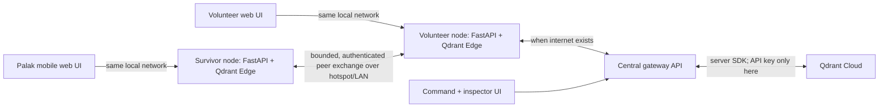

# RescueMemory: build plan for Qdrant PS03

**Decision document, 28 September 2026.** The team-chat PDF and earlier architecture PDFs are context and proposals, not verified implementation requirements. The actual problem statement asks for a local Qdrant Edge memory, offline retrieval, sensible local/cloud placement, intermittent sync, evolving/conflicting data, and a UI that exposes the memory and sync state. This plan is scoped for a September 30 demo if that date in the team chat is still the deadline.

**Implementation update:** The backend and Palak frontend have now been integrated on `shdra`. A live Qdrant Cloud smoke test passed for both an event and an authenticated guide; the synthetic records were removed. The survivor view now has offline extractive answers from the compact local MiniLM retrieval model, optional Gemini synthesis, a review-first SOS action, a light/dark toggle, and a 30-second local nearby-map refresh. See the repository README for current setup and test instructions. Remaining production-strength security and native Android work are identified below.

## 1. The product in one sentence

**RescueMemory lets a survivor ask for help and report what is happening; nearby devices carry those reports across a disconnected area, and a connected responder relays the same memory to command.** Each node can retrieve its own knowledge and reports through Qdrant Edge while the internet is unavailable.

The initial use case is a flooded campus or neighborhood. A survivor asks about safe water, reports that Gate 3 is flooded, and optionally shares a location with a responder. A nearby volunteer receives the report over a local hotspot, sees it on a map, and uploads it when internet returns. **Any connected node may relay allowed public/group observations to the gateway; it need not be a volunteer.** Responder-only SOS still follows responder authorization. Command publishes a verified alternate shelter; the volunteer and survivor receive that update on the next exchange. A judge can see exactly which node knows which fact and how it arrived.

### What makes the demo distinctive: Memory Ripple

Make the **journey of one fact** the signature feature. In the inspector, select a report and show its origin, received time, known hop path, visibility, last cloud receipt, and nodes known to hold it from sync receipts. A side-by-side view shows local knowledge before and after an exchange. Add a **Contradiction Radar** for a checkpoint: the older baseline says “open,” a fresh local report says “flooded,” and command later verifies “closed.” The product shows the competing observations and their sources, with the dangerous state prominent; it never silently overwrites history. This directly demonstrates the edge-to-cloud problem statement and is more memorable than another chatbot screen.

## 2. Facts from the current work

| Component | Current state | Build decision |
| --- | --- | --- |
| GitHub `main` | README and `.gitignore`; largely a vision document | Use as the shared integration base. |
| `origin/sonal` | Python `QdrantClient(path=...)`, dense retrieval, baseline checkpoints, 515 generated medical records; no app API or sync | Reuse schemas and useful seed ideas after review. Port any needed behavior to real `qdrant-edge-py`; do not describe local client mode as Edge. |
| `origin/Palak` | React/Vite activation and survivor HUD, visually developed but hardcoded and desktop sized | Use as the frontend starting point; connect it to real responses and make it responsive. Replace unsafe placeholder medical claims. |
| `E:\hackthon\code cubical\backend` | Working FastAPI + `qdrant-edge-py` shards, offline dense/BM25 hybrid search, local map, groups, responder SOS, multi-hop HTTP sync | Integrated into `shdra`; the Cloud bridge has since passed a live synthetic upload/download test. |
| `shdra` | Integrated edge/cloud prototype and Palak frontend are committed here | Continue feature work here; preserve teammate branches. |

Two claims in the supplied chat need correction before a pitch: (1) `QdrantClient(path=...)` is local mode of the Qdrant client, not Qdrant Edge. (2) the generated 515 protocols do not have per-record source evidence or medical review; an example combines “Femoral Bleed” with “Upper Extremity.” Do not call the collection clinically verified or ship it as emergency instructions. Earlier latency and memory numbers also need actual measurement on the demo hardware.

## 3. What runs where



**Qdrant Edge is an in-process Python/Rust library, not a web server and not Docker.** The demo node is a Python process with an Edge shard on its own disk. FastAPI is the local app API. Qdrant Cloud is the global server database; it needs an endpoint and Database API key, and no Docker. An optional local Qdrant Server in Docker is only a fallback if Cloud is unavailable, not the main architecture.

The Android screen is a **mobile web interface** for the prototype. A browser can cache its UI with a service worker, but a normal browser does not run the Python/Rust Edge library. For the deadline, host each Edge node on a laptop or another supported host and open Palak's mobile UI on Android over the same local Wi-Fi/hotspot. Turning off **internet** while keeping that LAN up proves local Edge retrieval and peer transfer. It does **not** prove fully disconnected, on-phone Qdrant Edge; say this plainly in the demo. A future native Android shell would bind the Rust Edge crate or a supported native runtime and add local discovery/transport. Do not spend the two-day build on an unproven APK bridge.

For the field demo, use one origin for the UI and API on each node (serve the built Vite assets through the local gateway) to avoid cross-origin surprises. Plain `http://<LAN-IP>` is adequate for a connected LAN web page but cannot guarantee installable PWA/service-worker behavior or browser geolocation. Service workers and geolocation generally need HTTPS or localhost; HTTPS pages calling an HTTP LAN API can hit mixed-content restrictions. Therefore, provide a **tap-to-place map pin/manual coordinates fallback**. Add PWA installation only after a tested secure-origin path exists. Prebundle the small demo basemap/zone graphic and assets; do not rely on live map tiles.

## 4. The smallest complete experience

### Survivor

1. Open the mobile HUD and see a real node/connection indicator, not hardcoded “OFFLINE.”
2. Ask in free text (“Where is safe water near Gate 3?”). Edge retrieves a short reviewed guidance card and relevant current local reports; show source, updated time, and “available on this node.”
3. Report a hazard, resource, or SOS. Select a map point; location sharing is explicit. The private SOS goes only to responder nodes, and a public hazard contains no survivor identity by default.
4. Join a group via QR/code and view its scoped reports. A new report appears immediately in local memory, before any sync.

### Volunteer

1. See nearby reports and expiring survivor presence on a local map, with red/yellow/green triage **reported status**, not an automated medical diagnosis.
2. Start a peer exchange over the hotspot. Show imported, exported, duplicate, and failed counts. If the peer is gone, keep local work and retry.
3. Bring internet back and uplink to command. Command can publish a verified shelter/checkpoint update that comes back down on subsequent exchanges.

### Command and judge inspector

1. Search/filter global reports in Qdrant Cloud through the gateway; show the Cloud-connected state and last successful sync.
2. Open a checkpoint timeline with all observations and an explicit effective status.
3. Open Memory Ripple: inspect a selected event's origin, scope, hop receipts, node holders, and what each node knew before and after sync. Filters show public/group/responder memory without exposing protected data to an unprivileged viewer.

## 5. The Qdrant design

**Local:** keep a reviewed reference shard and a mutable event shard in real Qdrant Edge. Both must survive process restart. Use a bundled 384-dimensional dense model and Edge's built-in BM25 sparse vectors; query both and fuse results with native reciprocal-rank fusion. Combine result sets across reference and mutable shards, then apply visibility, distance, freshness, and safety rules. Geo payload filters narrow candidates; calculate/show actual distance in the app. Pre-provision the model before disconnecting from internet. Optimize the reference shard after bulk ingest and schedule mutable optimization away from active queries. Test scalar quantization only if a measurement shows useful memory savings without unacceptable retrieval loss.

**Global:** a central gateway writes event points to Qdrant Cloud and reads permitted updates back. The Cloud API key lives only on this gateway, never in the browser or a survivor node. Use `qdrant-client` for the **Cloud/server connection**; that is an appropriate use of the client. Separate public, group, responder, and guide collections now prevent scope mixing. The gateway enforces access to group and responder data; devices never query Cloud directly. Production still needs stronger device identity and retention controls.

**Reference distribution:** seed a small, versioned pack on every local node for the deadline. Qdrant's recommended longer-term Edge/server pattern uses a mutable local shard plus an immutable server-snapshot shard and partial snapshots. Implementing partial snapshot lifecycle is an optional later milestone after event-level sync is stable; it is not needed for a 20-card pack. Edge is currently beta, so pin/test the installed version.

## 6. Data and sync rules

Use immutable observation events and derive current state. Extend the existing event schema incrementally instead of replacing IDs during integration:

```json
{
  "schema_version": 1,
  "id": "stable 64-character event ID",
  "content_hash": "hash of canonical event body",
  "origin_device": "node-a",
  "kind": "hazard | resource | checkpoint | incident | presence",
  "entity_id": "gate-3",
  "text": "Gate 3 is flooded",
  "location": {"lat": 28.70, "lon": 77.10},
  "visibility": "public | group | responders",
  "group_id": null,
  "observed_at": "UTC timestamp",
  "expires_at": null,
  "source_type": "survivor | volunteer | command",
  "source_ref": "optional reviewed source or verification reference"
}
```

- **Exact dedup:** an event keeps the same ID across hops. Repeated import is idempotent. An ID with a different body/hash is rejected, never silently replaced. Sync in bounded batches with a receipt/checkpoint, retry after disconnection, and persist receipt state in Edge. For this small dataset a full paged exchange is acceptable; per-peer cursors/outbox are the scalability upgrade.
- **Provenance:** for each accepted transfer, persist a small receipt containing `event_id`, sender node, receiver node, time, and transport; include a separate Cloud acknowledgment when the gateway commits it. Exchange receipts under the same visibility policy as their event. The inspector renders only **known** hops and known recipients; an unreported copy cannot be inferred.
- **Near duplicates:** reports about the same place/event can be grouped by `entity_id`, time window, and location/text similarity for the UI, but retain separate observations and reporters. Do not merge distinct people or SOS requests merely because text is similar.
- **Conflict:** show the timeline. For a potentially dangerous checkpoint, a fresh credible hazard stays prominent until an authorized verification resolves it. Mark “conflicting reports” when unresolved. A later correction is a new event that refers to the earlier one; no arbitrary last-write-wins.
- **Scopes:** public reports flow to all paired peers; group events only between nodes that possess that group's token; responder SOS flows one way from survivor to an authorized volunteer/command node. The group itself is joined by code/QR; its token is not a public event. Cloud uplink has an explicit policy per scope. Do not put mesh/admin/group secrets in shipped frontend JavaScript.
- **Connected survivor:** if a survivor node gains internet first, it may upload consented public/group records to the gateway and pull permitted global updates, then pass them to offline neighbors at their next LAN exchange. It must not become a responder-data reader merely because it has internet.
- **Location:** ask for consent, record observed time and accuracy if available, show approximate public locations, keep precise SOS coordinates responder-only, and expire presence after a short TTL. If GPS fails, allow manual map placement and label it as manually placed. A chat question alone is not permission to publish a location.
- **Transport:** HTTP exchange over a known LAN IP/QR or hotspot for the demo. Internet is needed only for the gateway-to-Cloud link. Bluetooth LE, Wi-Fi Direct discovery, background gossip, and true phone-to-phone radio transfer are post-demo work; do not advertise them as implemented.

## 7. Medical and retrieval safety gate

Ship **12–20 reviewed, high-value cards**, not 515 synthetic variations. Pick disaster-safe topics from official Red Cross/CDC/WHO guidance, such as calling emergency services, severe bleeding basics, CPR awareness, safe drinking water, hypothermia, and when to seek urgent help. For every card store its source URL, title, date checked, reviewer, version, steps, warning, and applicability. Have a teammate check every displayed step against the cited source. Keep clinical instructions conservative; do not invent improvised procedures, precise dosing, or diagnosis via free-form model output. If a query has weak retrieval or conflicting evidence, show “no reliable local guidance found” plus emergency contact advice. A local LLM is unnecessary for the core demo; the useful AI is offline semantic/hybrid retrieval over trusted local memory.

The current Sonal JSON is a **research draft in quarantine** until it has record-level citations and review. Palak's hardcoded “improvised tourniquet unlocked” placeholder must be removed or replaced with an approved card. Never label all 515 records “official” based on category-level source lists.

## 8. API contract to freeze before parallel work

Keep the working backend endpoints, publish an OpenAPI JSON snapshot, and give Palak typed example responses. Freeze the minimum UI routes first:

| UI action | API | Required response |
| --- | --- | --- |
| Free-text search/assessment | `POST /api/chat` initially; add `POST /api/assess` for materials/vitals only after safe rules are defined | ranked cards/reports, source, timestamps, node-local status, retrieval latency |
| Report hazard/resource/SOS | `POST /api/reports` | stable event ID, visibility, stored locally, duplicate flag |
| Map | `POST /api/map/nearby` | points, kind, status, distance, age, scope, location precision |
| Conflict detail | `GET /api/entities/{entity_id}` | chronological observations, effective state, reason |
| Groups | `POST /api/groups`, `POST /api/groups/join`, `GET /api/groups` | group ID/code and membership state |
| Memory/sync inspector | `GET /api/memory`, `GET /api/sync/status`, `GET /health`; add `GET /api/provenance/{event_id}` and a WAN/peer connectivity status route | shard counts, source, known hop receipts, last sync, failures; no secret material |
| Exchange | existing `/api/sync/peer`, `/api/sync/global` behind a gateway/UI-safe action | imported/exported/duplicate counts and receipts |

The existing `/api/chat` request currently accepts `text`, optional location/consent, group, and visibility; it does **not** accept Palak's material/vital inputs. Do not wire those controls to fake behavior. Either add a safe assessment contract and tests, or hide/disable them for the first integrated demo. A browser must not receive `NODE_ADMIN_KEY` just to trigger sync; add a restricted local action handler/session or run sync in the backend loop.

## 9. Team work and integration order

| Owner | First deliverable | Then |
| --- | --- | --- |
| **Sonal — Edge/retrieval** | Verify `qdrant-edge-py` in the shared backend, seed reviewed cards, confirm dense+BM25 hybrid, show offline restart/search test | Tune filters, inspect ranking on 15 example queries, measure latency/model size, investigate snapshot/quantization only after the end-to-end path works. |
| **Shdra — backend/sync/cloud** | Bring the tested workspace backend into `shdra`; define event/API contract; integrate LAN sync and expiry | Restrict Cloud mirror by scope, test live Qdrant Cloud with private credentials, expose safe UI sync/status, conflict/provenance endpoint, three-node test. |
| **Palak — frontend** | Rebase/merge her UI onto the agreed API contract; mobile layout, real search/report/map screens | Volunteer board, command inspector/Memory Ripple, sync receipts, scoped group UI, offline/connection states. |

Integration sequence: (1) create a short contract document/examples and commit it; (2) copy the existing working backend into `shdra` without overwriting Sonal's branch; (3) import Palak's frontend and replace hardcoded data with API calls; (4) port selected Sonal schemas/curated records to the Edge engine after safety review; (5) merge to `main` via PR when one complete demo path passes. Keep separate feature PRs where feasible. Do not wholesale merge an engine that uses `QdrantClient(path=...)` over the real Edge backend. Avoid simultaneous edits to the same engine and UI entry files.

## 10. Two-day schedule and gates

**Gate A, first 2 hours:** confirm deadline and device inventory; freeze scenario, one campus map with 3 named points, event/API schema, and exact responsibilities. Set up a Qdrant Cloud free cluster and keep its key in the central environment file. Decide who operates Node A, Node B, and command. Keep the demo working without Cloud credentials as an offline fallback.

**Gate B, next 6 hours:** move backend into repo; verify real Edge create/reload/search without internet; trim seed pack to reviewed cards; Palak wires search and report; show a survivor hazard locally. If this gate fails, stop adding features and fix it.

**Gate C, next 6 hours:** run two nodes across a real local LAN/hotspot, sync public and group data, relay private SOS to volunteer only, and show map status/duplicate receipt. Palak finishes volunteer view and manual location picker. Test node restart.

**Gate D, next 6 hours:** connect volunteer/central to Qdrant Cloud, test upload and downward verified update, add event provenance/conflict view, and measure results. Keep private/group data in their own Cloud collections behind gateway authorization.

**Gate E, final 4+ hours:** run the full script on the actual demo devices, disable internet, restart processes, check privacy and medical cards, record a backup screen capture, and freeze changes. Leave a setup script, sample data reset, and one-page operator checklist.

This is a roughly 24-hour focused build plan across three people, with the remaining time to the deadline for integration and rehearsal. If the deadline is closer, cut optional PWA install, snapshots, quantization, speech, and native radio transport before cutting the verified offline→peer→cloud story.

## 11. Acceptance tests and live demo

| Scene | Expected observable result |
| --- | --- |
| Disconnect WAN but keep hotspot/LAN | Node A search still retrieves from Edge and reports still save locally. UI labels network state correctly. |
| Restart Node A | Its reviewed pack and reports remain queryable. |
| A reports “Gate 3 flooded” | A map/inspector shows a new local event with timestamp and public scope; B does not yet have it. |
| A ↔ B exchange | B obtains exactly one copy; a repeated exchange reports duplicates and does not multiply markers. |
| Group report | Only a joined group node receives it; an unjoined node sees neither its content nor map pin. |
| Survivor SOS | Volunteer receives it; public node cannot read it; exact location is not on the public map. |
| B uplinks to command | A global record appears through the gateway in Cloud; record ID/provenance is preserved. |
| Command updates checkpoint | The verified update reaches B then A after exchange; old hazard stays in timeline and conflict state is visible. |
| Judge inspector | Shows before/after memory counts, source, hop receipts, last sync, and live measured query time. |

Minimum automated checks: persistence/restart, Edge hybrid retrieval, idempotent duplicate import, scope isolation, private SOS routing, conflict timeline, expiry, no Cloud key in frontend, and Cloud policy filtering. Run a short benchmark on the actual machine and report p50/p95 for **embedding plus query**, warm/cold boot, disk/model size, and whether internet was disabled. Do not set a marketing latency target before measuring it.

**90-second pitch:** “A disaster breaks the connection first, then the information flow. RescueMemory keeps searchable guidance and local reports on Qdrant Edge. This flooded-gate report exists only on this survivor node. When our volunteer comes within local network range, it moves one hop; when the volunteer reaches internet, it becomes visible in Qdrant Cloud. A verified shelter update comes back the same way. Here is the exact path, the duplicate check, and the conflict history.” Then perform the scenes above with live status changes.

## 12. Risks and honest boundaries

1. **Phone-local Edge is not proved by a mobile web screen.** Label the backend host clearly. A real Android deployment requires native binding/runtime and radio transport validation.
2. **PWA/GPS over an HTTP LAN IP is unreliable.** Use the web page plus manual map pin for the deadline; test HTTPS/PWA separately.
3. **Cloud depends on live internet and credentials.** The synthetic live read/write check passed, but the demo must still handle a lost connection and keep the key only in the central environment. No Docker is required.
4. **Medical data needs review.** Ship a small cited pack, not the 515 generated records; treat retrieval as guidance lookup, not diagnosis.
5. **Peer security is prototype grade.** Shared tokens and HTTP are adequate only on a controlled demo network. Before any real disaster use: device identity, authenticated signed events, encrypted transport, key rotation, responder authorization, abuse controls, retention and consent audit.
6. **No automatic radio mesh is currently implemented.** The demo uses explicit LAN/hotspot exchange with retries. The UI should say “exchange with nearby node,” not “Bluetooth mesh.”

## Official references used

- Qdrant [Edge overview](https://qdrant.tech/documentation/edge/), [quickstart](https://qdrant.tech/documentation/edge/edge-quickstart/), [Edge versus Server](https://qdrant.tech/documentation/edge/edge-vs-qdrant-cluster/), [BM25](https://qdrant.tech/documentation/edge/edge-bm25/), [query API](https://qdrant.tech/documentation/edge/edge-api/reading-data/), and [synchronization guide](https://qdrant.tech/documentation/edge/edge-synchronization-guide/).
- Qdrant [Cloud quickstart](https://qdrant.tech/documentation/cloud-quickstart/) and [Cloud cluster access](https://qdrant.tech/documentation/cloud/cluster-access/).
- MDN [service workers](https://developer.mozilla.org/en-US/docs/Web/API/Service_Worker_API), [geolocation secure context](https://developer.mozilla.org/en-US/docs/Web/API/Geolocation_API), and [mixed content](https://developer.mozilla.org/en-US/docs/Web/Security/Defenses/Mixed_content).
- Review candidate medical cards against official [Red Cross first aid](https://www.redcross.org/take-a-class/resources/learn-first-aid), [CDC emergency water](https://www.cdc.gov/water-emergency/safety/index.html), and [WHO emergencies](https://www.who.int/emergencies) pages. These links do not validate any generated record by themselves.
