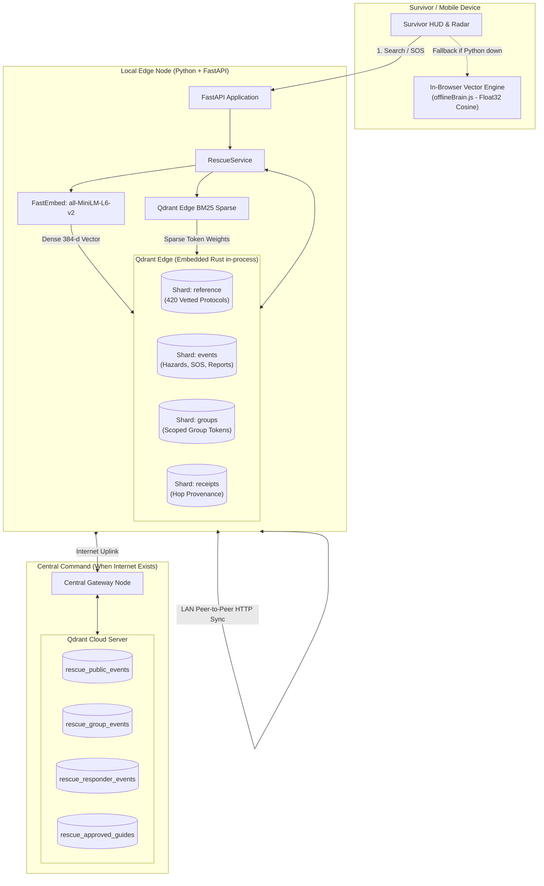
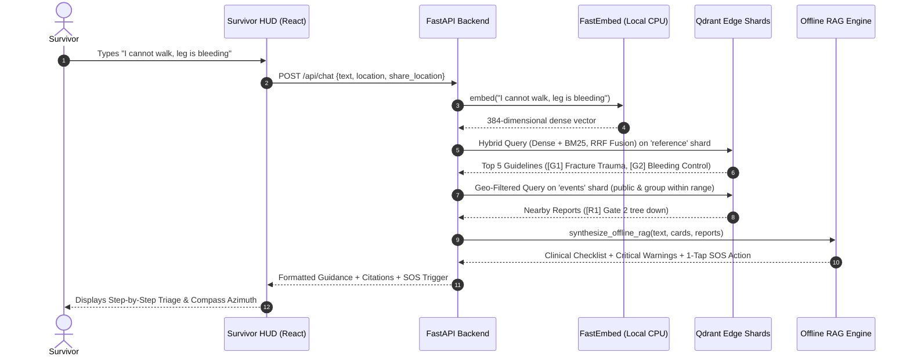

# How Qdrant Works Inside RescueMemory: Complete Architectural Guide

This guide explains **how Qdrant works inside the application at every step**, translated into simple, intuitive concepts. It is designed to give you a deep understanding of the system and prepare you for any judge questions or technical cross-examination.

---

## 1. High-Level Architecture: Where Does Qdrant Live?

Most people think of Qdrant as a cloud database or a Docker container. In RescueMemory, **we use two different layers of Qdrant**:

1. **Local Edge (`qdrant-edge-py`)**: An embedded in-process database written in Rust. Just like SQLite lives inside a local app without needing a server, **Qdrant Edge runs directly inside the Python process on local disk**. It needs **zero internet, zero Docker, and zero cloud setup**.
2. **Qdrant Cloud (`qdrant-client`)**: A global server cluster hosted in the cloud. It is used **only by the central command node** when internet is available to mirror records globally.



---

## 2. Step-by-Step Breakdown: What Happens Under the Hood

### Step 1: Splitting Memory into 4 Shards (`backend/app/memory.py`)
Instead of dumping everything into one bucket, Qdrant Edge initializes **four separate local folder shards** on the device's hard drive:
1. `reference`: Permanent survival encyclopedias, 420 clinical emergency protocols, and verified shelter landmarks. **Immutable** (never overwritten by user reports).
2. `events`: Dynamic field observations (hazards, road washouts, trapped survivor SOS pings, presence).
3. `groups`: Family or neighborhood encryption keys and group membership tokens.
4. `receipts`: Multi-hop transfer receipts proving how information jumped from node to node.

> **How Point IDs Work (`point_id()`)**:  
> Qdrant Edge requires 64-bit integer IDs. We take the SHA-256 hash of an event’s unique ID string, slice the first 8 bytes, and convert it to an integer. This ensures the **exact same report gets the exact same point ID on every device in the disaster area**, preventing duplicate records.

---

### Step 2: Converting Words into Numbers (Dense + Sparse Embeddings)
Computers cannot search concepts like *"severe bleeding"* or *"flooded bridge"* as raw text without matching only exact keywords. Qdrant Edge uses **two complementary representations**:

```
Text: "How to stop deep leg bleeding?"
  ├── 1. Dense Embedding (FastEmbed): [0.042, -0.198, 0.311, ... 384 numbers]
  │      ↳ Captures MEANING (connects "deep leg bleeding" to "arterial hemorrhage" and "tourniquet").
  │
  └── 2. Sparse Embedding (BM25): {"bleeding": 2.41, "leg": 1.83, "deep": 1.25}
         ↳ Captures EXACT KEYWORDS (guarantees specific medical or location terms match).
```

* **Dense Vectors (`memory.py:25-29`)**: Generated locally using `sentence-transformers/all-MiniLM-L6-v2` via `fastembed`. It runs on CPU in milliseconds with zero cloud connection.
* **Sparse Vectors (`memory.py:30`)**: Generated using Qdrant Edge's built-in `Bm25()` with Inverse Document Frequency (`Modifier.Idf`).

---

### Step 3: Hybrid Search with Reciprocal Rank Fusion (RRF) (`memory.py:96-110`)

When a survivor asks a question in the chat:
```python
request = QueryRequest(
    limit=5,
    prefetches=[
        Prefetch(limit=20, query=Query.Nearest(dense, using="dense"), filter=filter_),
        Prefetch(limit=20, query=Query.Nearest(sparse, using="bm25"), filter=filter_),
    ],
    query=Fusion.Rrf(k=2),
    with_payload=True,
)
```

#### Why Hybrid + RRF?
* If a survivor asks: *"Where can I get safe water?"*
  - **Dense search** understands that *"safe water"* means *"boiling, filtration, purification tablets"*.
* If a survivor asks: *"Is checkpoint CP-17 open?"*
  - **BM25 search** guarantees that the exact code *"CP-17"* is matched, not a generic checkpoint.
* **Reciprocal Rank Fusion (`Fusion.Rrf`)** merges both ranking lists into a single score:
  $$\text{Score} = \frac{1}{k + \text{Rank}_{\text{dense}}} + \frac{1}{k + \text{Rank}_{\text{sparse}}}$$
  This ensures that both concept matches and exact codes bubble to the top.

---

### Step 4: Physical Geospatial Search (`memory.py:111-118`)

During a disaster, medical advice 500 kilometers away is useless. Qdrant Edge maintains a **Geospatial Payload Index** on the `location` field (`PayloadSchemaType.Geo`).

```python
geo = Filter(must=[FieldCondition(
    key="location", geo_radius=GeoRadius(
        center=GeoPoint(lon=user_lon, lat=user_lat),
        radius=3500, # 3.5 km radius
    ),
)])
```
When you open the **Tactical Map** or **Survival Radar**, Qdrant filters points in a circle around the survivor’s GPS location natively in Rust, so the phone only displays threats and resources within walking distance.

---

### Step 5: Negative Vector Arithmetic — Safe Shelter Recommendation (`memory.py:137-206`)

This is one of the most innovative features in the system.

**The Problem**: Checkpoint CP-17 is a designated emergency clinic, but a fresh field report says: *"Flooded entrance and live electrical wires down"*. If a user asks for a shelter, standard search might still recommend CP-17 because it matches "clinic" and "shelter".

**The Qdrant Vector Math Solution**:
1. Take the embedding vector of the compromised facility ($V_{\text{base}}$).
2. Take the embedding vector of the hazard ($V_{\text{hazard}}$).
3. **Subtract the hazard vector** from the base facility vector:
   $$V_{\text{target}} = \text{normalize}(V_{\text{base}} - 0.5 \cdot V_{\text{hazard}})$$
4. Query Qdrant Edge for nearest checkpoints to $V_{\text{target}}$, explicitly excluding the compromised ID.

```
       [High Hazard Vector: Flooding & Live Wires]
                      ▲
                      │  (Subtract 0.5 * Hazard)
                      │
[CP-17: Clinic + Power] ───► [Target Search Vector] ───► Finds: [Clinic Beta: High Ground + Surgery]
```

**Result**: Qdrant finds an alternative facility that **shares the medical resources** of CP-17 while being as far away as possible in vector space from the flooding hazard!

---

### Step 6: Edge-to-Cloud Mirroring (`backend/app/cloud.py`)

* Survivor devices never talk to Qdrant Cloud directly (they have no cloud API keys and no internet).
* When a volunteer or central node reaches internet connectivity, it calls `mirror_to_qdrant_server()`:
  1. Scrolls events from Qdrant Cloud using `client.scroll()`.
  2. Compares hashes to prevent overwrite collisions.
  3. Uploads local reports to separate Cloud collections (`rescue_public_events`, `rescue_group_events`, `rescue_responder_events`) in batches of 64 using `client.upsert(points=[...])`.
  4. Downloads command-verified guides and official status updates back down to the local edge node.

---

### Step 7: Standalone In-Browser Vector Engine (`frontend/src/brain/offlineBrain.js`)

**What if the Python backend is completely unreachable?** (e.g., survivor has only a phone with the PWA cached).
* The PWA loads pre-computed vector files (`knowledge_cards.json` and `knowledge_vectors.json`).
* It executes **client-side Float32 dot-product cosine similarity** directly inside browser JavaScript.
* Search, guidance retrieval, and negative vector calculations still work with **zero server and zero network**.

---

## 3. End-to-End Walkthrough: What Happens When a Survivor Types a Message



---

## 4. Cheat Sheet for Judges & Cross-Questioning (FAQ)

### Q1: "Why use Qdrant Edge instead of running standard Qdrant in Docker?"
> **Answer**:  
> *"In a real flood or grid collapse, survivors and volunteers are running on battery-powered mobile phones and field laptops without internet. Standard Qdrant requires a daemon, network sockets, Docker, and heavy background resources. **Qdrant Edge runs directly in-process as a compiled Rust library linked into Python**, writing binary shards directly to disk. It boots instantly, uses negligible memory, and operates 100% offline."*

### Q2: "Why do you use both Dense Vectors and BM25 Sparse Vectors?"
> **Answer**:  
> *"Dense vectors understand semantic meaning—for example, mapping 'cannot walk' to 'femur fracture protocol' even when the exact words differ. But dense vectors can blur distinct alphanumeric codes like 'Shelter CP-17' versus 'Shelter CP-18'. By using **Qdrant's native Reciprocal Rank Fusion (RRF)**, we combine the semantic intelligence of all-MiniLM-L6-v2 with the exact keyword precision of BM25 in a single atomic query."*

### Q3: "How does the negative vector math work for rerouting around hazards?"
> **Answer**:  
> *"When a shelter like CP-17 is reported flooded with live wires, standard search would still retrieve it because its amenities match 'clinic' and 'shelter'. We compute:  
> $V_{\text{target}} = \text{normalize}(V_{\text{base}} - 0.5 \cdot V_{\text{hazard}})$  
> In vector space, this vector retains the direction of medical shelter amenities while pointing directly away from the hazard cluster, allowing Qdrant to immediately return a safe, equivalent facility like Clinic Beta."*

### Q4: "How do you prevent data corruption or infinite sync loops across peer nodes?"
> **Answer**:  
> *"Every observation has a deterministic 64-character SHA-256 hash derived from its canonical body. When nodes sync over local Wi-Fi hotspots, repeated transfers of the same event produce identical point IDs. Qdrant Edge treats duplicate IDs idempotently without creating duplicate map pins, while our provenance receipts shard records each hop for the Memory Ripple inspector."*

### Q5: "What happens if the laptop running Python dies?"
> **Answer**:  
> *"The frontend PWA includes a client-side vector engine (`offlineBrain.js`). It caches pre-computed vector shards in browser IndexedDB/ServiceWorker and computes Float32 cosine similarity directly in JavaScript, so search and triage never fail even if all backend infrastructure drops."*
